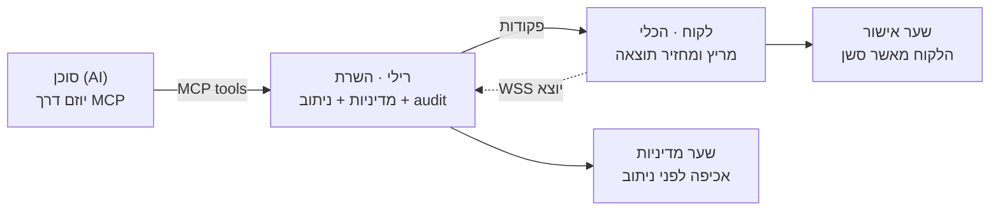
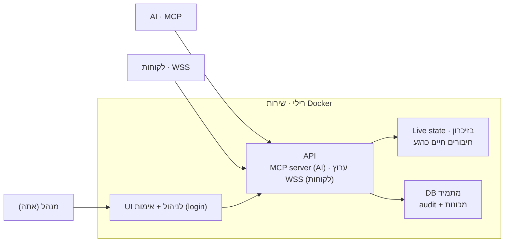
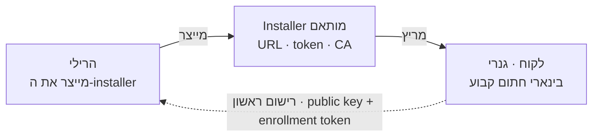

# AiRemoteAccess — ארכיטקטורת Relay (תכנון לפיתוח עתידי)

> **סטטוס: טיוטת תכנון.** המסמך הזה לא מתאר את הכלי הקיים בריפו (`warp`), אלא
> **חזון לגרסה עתידית ונפרדת**. אם הכלי יתפתח לכיוון הזה, זה כנראה ייכתב מאפס
> כפרויקט עצמאי — הכלי הנוכחי הוא כלי חד-פעמי (ephemeral), והרילי המתואר כאן הוא
> שירות תמידי. שמור את המסמך כנקודת מוצא לאותו פרויקט.

שליטה מרחוק ביוזמת AI, דרך שרת מתווך (Relay) שכל משתמש מארח לעצמו (self-hosted),
שעובד גם מעבר ל-NAT.

---

## מודל ומונחים

שלושה אקטורים. אף אחד מהם לא מחובר ישירות לאחרים — **הכול עובר דרך הרילי**:

| אקטור | תפקיד |
|---|---|
| **סוכן (AI)** | היוזם. מקבל משימה ומבקש פעולות דרך `MCP`. לעולם לא נוגע במכונה ישירות. |
| **רילי · השרת** | שירות מרכזי self-hosted. אוכף מדיניות, מנתב פקודות, ומחזיק את ה-audit. נקודת השליטה. |
| **לקוח · הכלי** | רץ על מכונת היעד. מחייג החוצה אל הרילי, מריץ פקודות, ומחזיר תוצאה. |

הרילי הוא רכיב ש**כל משתמש מארח לעצמו** — כמו `hbbs`/`hbbr` של RustDesk או שרת
MeshCentral. אין רילי מרכזי אחד לכל המשתמשים; אתה מפיץ תוכנה, וכל אחד מרים רילי
משלו. התוצאה: אף סוד ואף גישה למכונות של אף אחד לא עוברים דרכך.

*בקשה עוברת שני שערים בלתי-תלויים לפני שהיא רצה בפועל.*

---

## עקרונות ליבה

- **הלקוח תמיד מחייג החוצה.** הלקוח מאחורי NAT, אז הרילי לא יכול ליזום חיבור
  פנימה. הלקוח פותח `WSS` יוצא; הרילי דוחף פקודות במורדו. עובד בכל טופולוגיה.
- **הרילי הוא נקודת השליטה.** ה-AI מדבר רק מול ה-`MCP server` של הרילי. מה שהוא
  יכול לעשות מוגדר ע"י אילו tools נחשפו ומה המדיניות מרשה — לא ע"י התנהגות ה-AI.
- **Self-hosted, בלי סודות מרכזיים.** כל משתמש מארח רילי משלו. אין crown-jewel
  מרכזי שפריצתו חושפת את כולם. גם טיעון מכירה: "הסודות שלך לא עוברים דרכי".
- **שני שערים בלתי-תלויים.** שער מדיניות ברילי (allowlist, scoping,
  human-in-the-loop, audit) ושער אישור אנושי אצל הלקוח. פקודה צריכה לעבור את שניהם.

---

## זרימת פקודה מקצה לקצה

1. **הלקוח מופעל ואושר**, מחייג לרילי, נרשם ונשאר מחובר. הרילי מסמן אותו online.
   `Client → Relay · WSS`
2. **אתה נותן ל-AI משימה** ("בדוק דיסק במכונה X"). ה-AI הוא היוזם. `You → AI`
3. **ה-AI קורא ל-tool של הרילי.** `AI → Relay · run_command(machine, cmd)`
4. **הרילי מפעיל שער מדיניות.** אם עבר — דוחף את הפקודה במורד ה-WSS הקיים של
   הלקוח. `Relay → Client · over existing WSS`
5. **הלקוח עובר שער אישור** (אם מושגח), מריץ, ושולח תוצאה במעלה אותו WSS.
   `Client → Relay · result`
6. **הרילי מחזיר את התוצאה ל-AI** כתשובת ה-tool. `Relay → AI · tool response`

ה-AI אף פעם לא מתחבר ישירות ללקוח, ושום סוד לא נוסע אליו. חלופה ל-socket חי:
הלקוח עושה **polling** ("יש פקודות בשבילי?") — אותו כיוון ידידותי ל-NAT, רק
שהלקוח הוא ששואל.

---

## מבנה פנימי של הרילי

הרילי הוא שירות Docker תמידי עם UI לניהול. שים לב להפרדה בין מידע נדיף למידע מתמיד.

*ה-DB יושב על Docker volume — שורד `docker compose down`. ה-audit הוא append-only.*

### Live state (נדיף, בזיכרון)
אילו לקוחות מחוברים כרגע, ה-socket החי של כל אחד, סטטוס online/offline. מת
ומצטבר מחדש בכל פעם שלקוח מחייג — אין טעם לשמר.

### מידע מתמיד (ב-DB, שורד restart)
רשומת כל מכונה שנרשמה אי-פעם (hostname, OS + ארכיטקטורה, ראייה אחרונה), וה-audit
log — כל פקודה, מי יזם, מתי, תוצאה. זה מה ש"לא נמחק". פרטי המכונה מגיעים מהלקוח
ב-payload הרישום; אל תנסה לגלות אותם מצד הרילי.

---

## דרישות אבטחה

- **ה-UI הוא קונסולת השליטה** — חייב login + session. מי שמגיע לפורט בלי אימות
  מקבל shell על כל המכונות.
- **audit append-only** — אם ה-UI יכול לערוך או למחוק לוג, זה כבר לא audit אמין.
  לכל היותר rotation לפי גיל.
- **אחסון מתמיד ב-volume** — לא בתוך הקונטיינר, אחרת `compose down` מוחק את ה-audit.
- **הרשאה בשכבת ה-MCP** — *איזה* AI/משתמש מורשה לאיזו מכונה ולאיזה tools. אחרת
  חשפת `run_command` לכל מי שמדבר עם הרילי.
- **בטוח כברירת מחדל** — TLS כפוי, token חזק שנוצר אוטומטית בהתקנה, ואזהרה אם
  רצים חשופים בלי אימות. משתמשים פחות-מנוסים יריצו את זה בעצמם.
- **זהות סוכן ואישור אפמרי** — אל תשמור ברילי tokens ארוכי-חיים ל-shell; עדיף
  authorization פר-סשן, וזהות לקוח דרך keypair (רצוי mTLS).

> **שני מצבי-לקוח.** שער האישור אצל הלקוח מתאים כשיש בן אדם ליד המכונה שאמור
> להסכים (*מושגח*). למכונות שרצות ללא השגחה (*לא-מושגח*) אין מי שילחץ "אשר" — שם
> מחליפים אותו בהרשאה מוגדרת מראש בזמן ההתקנה, או policy ברילי שמתיר סוג הרצה
> מוגבל בלבד ללא human-in-the-loop.

---

## חשיפה — agnostic

הרילי לא יודע כלום על איך הוא חשוף. הוא מקשיב על `127.0.0.1:PORT`, ואיך שהוא יוצא
החוצה — Cloudflare Tunnel, reverse proxy, VPN, LAN — זו בחירה של מי שמרים אותו,
לא של הרילי. אתה מספק origin; החשיפה decoupled. זה מוריד ממך אחריות: אין צורך
לתמוך ב-N דרכי חשיפה או לצרף tunnel פנימה.

שתי אחריויות נשארות על הרילי דווקא *כי* אינך יודע איך יחשפו אותו:

- **בטוח גם אם נגיש לעולם** — אימות לפני כל דבר, brute-force lockout, ו-rate
  limiting. אל תניח שכבת הגנה חיצונית; אם היא קיימת — בונוס.
- **TLS בקצה, מתועד** — ברוב ה-tunnel/proxy ה-origin רץ HTTP וה-terminator מסיים
  TLS. תקין — כל עוד אזהרה בהפעלה מונעת חשיפה ישירה בטעות
  (`no TLS terminator — do not expose directly`).

---

## רכיבי הפצה

| רכיב | תיאור |
|---|---|
| **הרילי** | שרת self-hosted, בינארי אחד (Go מתאים) עם config לפורט/דומיין/tokens. אידיאלית `docker compose up` שמקים בפקודה אחת. |
| **הלקוח** | בינארי גנרי אחד, חתום וקבוע, שאתה מפיץ. הרילי לא מקמפל אותו — הוא רק מייצר installer שנצמד אליו את ה-URL/token/CA שלו. |
| **חיבור ה-AI** | ה-MCP server שהרילי חושף, שאליו המשתמש מחבר את ה-AI שלו (`list_machines`, `run_command`…). |

---

## Provisioning ו-Enrollment

איך לקוח מסוים יודע להתחבר לרילי מסוים? הוא לא "מגלה" — הוא נולד עם הידיעה. אתה
בונה בינארי לקוח גנרי אחד, והרילי מייצר **installer מותאם** שנושא את ה-URL,
ה-enrollment token וה-CA שלו. הבינארי לא משתנה בין רילי לרילי; רק המעטפת שנצמדת
אליו. זה config-baking — לא קומפילציה פר-רילי, שתהפוך כל רילי למפעל build.

*ברישום הראשון הרילי מאמת את ה-enrollment token ומנפיק ללקוח זהות קבועה
מבוססת-keypair.*

הפרדת שני ה-tokens פותרת את בעיית האבטחה האמיתית:

- **enrollment token** — משותף, מוטבע ב-installer, בר-ביטול וסבב. תפקידו היחיד:
  להוכיח לרילי "אני התקנה לגיטימית".
- **זהות קבועה** — ברישום הראשון הלקוח מייצר keypair מקומית ושולח public key
  בלבד. מכאן הוא מזדהה עם הזהות הזאת, לא עם ה-enrollment token.

כך installer שדלף לא נותן שליטה על מכונות קיימות (לכל אחת זהות משלה), ואפשר לבטל
enrollment token בלי לגעת ברשומות. "לקוח מותאם לרילי" אף פעם לא אומר "shell-token
קבוע בפנים".

---

## הבדל מהכלי הקיים (`warp`)

ב-README של הכלי הנוכחי כתוב שהלוג נמחק כשעוצרים את התהליך, וכל הגישה אפמרית —
URL ו-token נעלמים עם התהליך. הרילי הפוך: שירות תמידי עם אחסון מתמיד ולוג שלא
נמחק — audit שנעלם בכל restart הוא חסר ערך. כלומר הרילי הוא **לא אותו רכיב** כמו
הכלי החד-פעמי, אלא שירות בפני עצמו. זו הסיבה שהפיתוח העתידי הוא כנראה כתיבה מאפס
כפרויקט נפרד, ולא הרחבה של `main.py` הקיים.

| | הכלי הקיים (`warp`) | הרילי (עתידי) |
|---|---|---|
| אורך חיים | אפמרי — נעלם עם התהליך | שירות תמידי |
| audit log | נמחק בעצירה | מתמיד, append-only, ב-volume |
| טופולוגיה | חיבור ישיר / tunnel חד-פעמי | הלקוח מחייג החוצה, ריבוי מכונות |
| ריבוי מכונות | מכונה בודדת פר-הרצה | רישום וניהול של הרבה מכונות |
| ניהול זהויות | token אקראי פר-סשן | enrollment token + keypair קבוע |
| ממשק AI | URL + token ל-HTTP endpoint | MCP server עם tools ומדיניות |

---

## רפרנסים ללמידה

Open-source, self-hosted — ללמוד מהדפוסים, **לא** לחבר אליהם את הלקוח שלך:

- **MeshCentral** ו-**TacticalRMM** — למודל ההרשאות/ההסכמה ול-agent↔broker auth.
- **hbbs/hbbr של RustDesk** — ל-relay הטהור.

---

*מקור התכנון: `airemoteaccess-relay-design.html`. מסמך זה הוא עיבוד שלו ל-Markdown
לצורך שמירה בריפו.*
