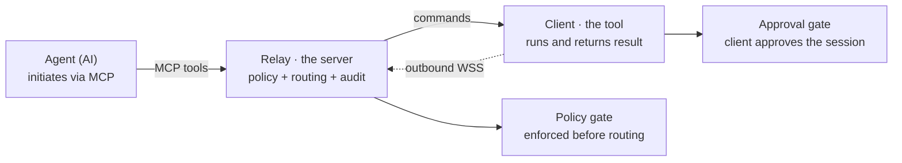
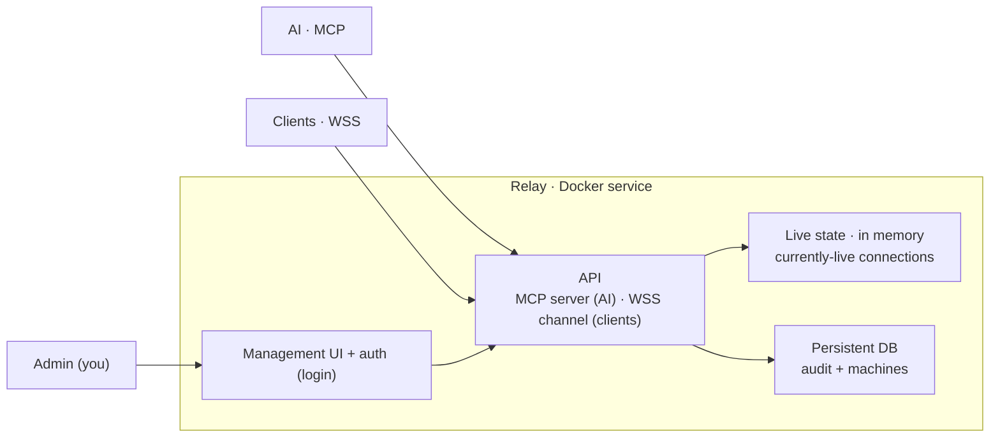
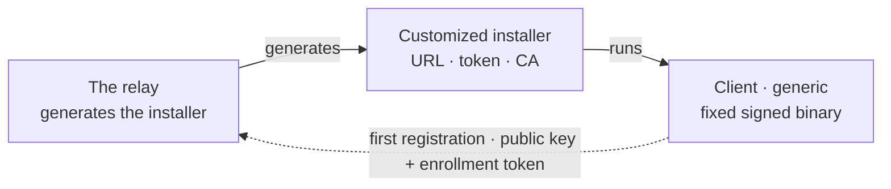

# AiRemoteAccess — Relay Architecture (future-development design)

> **Status: draft design.** This document does **not** describe the current tool
> in this repo (`warp`). It describes a **vision for a future, separate version**.
> If the tool ever moves in this direction it will most likely be written from
> scratch as a standalone project — the current tool is ephemeral (one-shot),
> while the relay described here is a persistent service. Keep this as the
> starting point for that project.

AI-initiated remote control, through a **self-hosted** relay server that each
user runs for themselves, working across NAT.

---

## Model and terminology

Three actors. None of them connects directly to the others — **everything goes
through the relay**:

| Actor | Role |
|---|---|
| **Agent (AI)** | The initiator. Receives a task and requests actions over `MCP`. Never touches the machine directly. |
| **Relay · the server** | Central self-hosted service. Enforces policy, routes commands, and owns the audit log. The control point. |
| **Client · the tool** | Runs on the target machine. Dials out to the relay, executes commands, and returns the result. |

The relay is a component that **every user hosts themselves** — like RustDesk's
`hbbs`/`hbbr` or a MeshCentral server. There is no single central relay for all
users; you distribute software, and each person stands up their own relay. The
result: no secret and no access to anyone's machines ever passes through you.

*A request passes through two independent gates before it actually runs.*

---

## Core principles

- **The client always dials out.** The client sits behind NAT, so the relay
  can't initiate a connection inward. The client opens an outbound `WSS`; the
  relay pushes commands down it. Works in any topology.
- **The relay is the control point.** The AI talks only to the relay's
  `MCP server`. What it can do is defined by which tools are exposed and what the
  policy allows — not by the AI's behavior.
- **Self-hosted, no central secrets.** Each user hosts their own relay. There is
  no central crown-jewel whose breach exposes everyone. Also a selling point:
  "your secrets never pass through me."
- **Two independent gates.** A policy gate at the relay (allowlist, scoping,
  human-in-the-loop, audit) and a human approval gate at the client. A command
  must clear both.

---

## End-to-end command flow

1. **The client starts and is approved**, dials the relay, registers, and stays
   connected. The relay marks it online. `Client → Relay · WSS`
2. **You give the AI a task** ("check the disk on machine X"). The AI is the
   initiator. `You → AI`
3. **The AI calls a relay tool.** `AI → Relay · run_command(machine, cmd)`
4. **The relay runs the policy gate.** If it passes — it pushes the command down
   the client's existing WSS. `Relay → Client · over existing WSS`
5. **The client passes the approval gate** (if attended), runs the command, and
   sends the result back up the same WSS. `Client → Relay · result`
6. **The relay returns the result to the AI** as the tool response.
   `Relay → AI · tool response`

The AI never connects directly to the client, and no secret ever travels to it.
An alternative to a live socket: the client **polls** ("any commands for me?") —
the same NAT-friendly direction, only the client is the one asking.

---

## Relay internal structure

The relay is a persistent Docker service with a management UI. Note the
separation between volatile and persistent state.

*The DB sits on a Docker volume — survives `docker compose down`. The audit log
is append-only.*

### Live state (volatile, in memory)
Which clients are connected right now, each one's live socket, online/offline
status. Dies and rebuilds itself every time a client dials in — no point
persisting it.

### Persistent state (in the DB, survives restart)
A record of every machine that ever registered (hostname, OS + architecture,
last seen), and the audit log — every command, who initiated it, when, and the
result. This is what "is never deleted." Machine details come from the client in
the registration payload; don't try to discover them from the relay side.

---

## Security requirements

- **The UI is the control console** — must have login + session. Anyone who
  reaches the port without auth gets a shell on every machine.
- **Append-only audit** — if the UI can edit or delete a log entry, it's no
  longer a trustworthy audit. Age-based rotation at most.
- **Persistent storage on a volume** — not inside the container, otherwise
  `compose down` wipes the audit.
- **Authorization at the MCP layer** — *which* AI/user is allowed on which
  machine and which tools. Otherwise you've exposed `run_command` to anyone who
  can talk to the relay.
- **Secure by default** — forced TLS, a strong token auto-generated at install
  time, and a warning if running exposed without auth. Less-experienced users
  will run this themselves.
- **Agent identity and ephemeral authorization** — don't store long-lived shell
  tokens on the relay; prefer per-session authorization, and client identity via
  a keypair (ideally mTLS).

> **Two client modes.** The approval gate at the client fits when there's a human
> next to the machine who is supposed to consent (*attended*). For your own
> machines that run unattended there's nobody to press "approve" — there you
> replace it with authorization defined at install time, or a relay policy that
> permits only a restricted kind of execution without a human in the loop.

---

## Exposure — agnostic

The relay knows nothing about how it's exposed. It listens on `127.0.0.1:PORT`,
and however it reaches the outside world — Cloudflare Tunnel, reverse proxy, VPN,
LAN — that's a choice made by whoever runs it, not by the relay. You provide an
origin; exposure is decoupled. That reduces your responsibility: no need to
support N exposure methods or bundle a tunnel in.

Two responsibilities stay on the relay precisely *because* you don't know how it
will be exposed:

- **Safe even if reachable from the world** — auth before anything else, the
  brute-force lockout, and rate limiting. Don't assume an external protection
  layer; if one exists — bonus.
- **TLS at the edge, documented** — with most tunnels/proxies the origin runs
  HTTP and the terminator handles TLS. That's fine — as long as a startup warning
  prevents accidental direct exposure
  (`no TLS terminator — do not expose directly`).

---

## Distribution components

| Component | Description |
|---|---|
| **The relay** | Self-hosted server, a single binary (Go fits well) with config for port/domain/tokens. Ideally `docker compose up` brings it up in one command. |
| **The client** | A single generic, signed, fixed binary that you distribute. The relay doesn't compile it — it only generates an installer that attaches its URL/token/CA to it. |
| **The AI connection** | The MCP server the relay exposes, which the user connects their AI to (`list_machines`, `run_command`…). |

---

## Provisioning and enrollment

How does a given client know to connect to a given relay? It doesn't "discover" —
it's born knowing. You build one generic client binary, and the relay generates a
**customized installer** that carries its URL, enrollment token, and CA. The
binary doesn't change from relay to relay; only the wrapper attached to it does.
This is config-baking — not per-relay compilation, which would turn every relay
into a build factory.

*On first registration the relay verifies the enrollment token and issues the
client a permanent keypair-based identity.*

Separating the two tokens solves the real security problem:

- **Enrollment token** — shared, baked into the installer, revocable and
  rotatable. Its only job: to prove to the relay "I'm a legitimate install."
- **Permanent identity** — on first registration the client generates a keypair
  locally and sends only the public key. From then on it identifies with that
  identity, not with the enrollment token.

This way a leaked installer grants no control over existing machines (each has
its own identity), and you can revoke an enrollment token without touching any
records. "A client customized to a relay" never means "a fixed shell token
inside."

---

## Difference from the current tool (`warp`)

The current tool's README states that the log is deleted when the process stops,
and that all access is ephemeral — the URL and token vanish with the process. The
relay is the opposite: a persistent service with persistent storage and a log
that isn't deleted — an audit that disappears on every restart is worthless. In
other words, the relay is **not the same component** as the one-shot tool; it's a
service in its own right. That's why the future development is likely a rewrite
from scratch as a separate project, rather than an extension of the current
`main.py`.

| | Current tool (`warp`) | Relay (future) |
|---|---|---|
| Lifetime | Ephemeral — vanishes with the process | Persistent service |
| Audit log | Deleted on stop | Persistent, append-only, on a volume |
| Topology | Direct connection / one-shot tunnel | Client dials out, many machines |
| Multiple machines | Single machine per run | Registration and management of many machines |
| Identity management | Random token per session | Enrollment token + permanent keypair |
| AI interface | URL + token to an HTTP endpoint | MCP server with tools and policy |

---

## References to learn from

Open-source, self-hosted — learn from the patterns, do **not** connect your
client to them:

- **MeshCentral** and **TacticalRMM** — for the permission/consent model and
  agent↔broker auth.
- **RustDesk's hbbs/hbbr** — for the pure relay.

---

*Design source: `airemoteaccess-relay-design.html`. This document is a Markdown
adaptation of it, kept in the repo for reference.*
